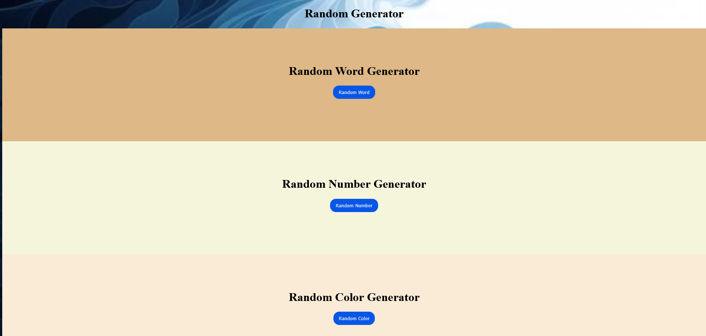
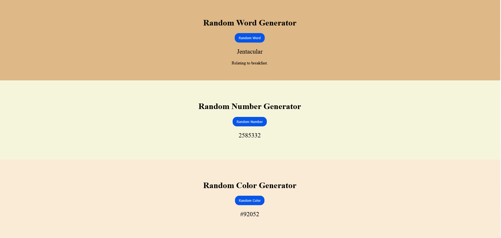
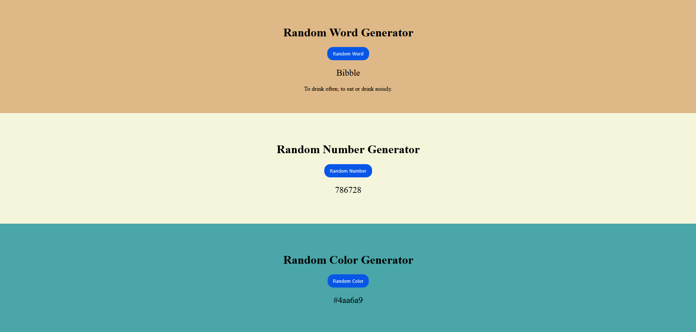

# Random Color Generator

## Description
The **Random Generator** is a web application that allows users to generate random words, numbers, and colors in a webpage or a specific section. 
The application is designed with chat gpt giving a single method of the function Generate random words.

## Screenshot(s)





*(Make sure to upload a screenshot of your working project and replace the placeholder path)*

## Technologies Used
- **HTML**: For structure and content of the webpage.
- **CSS**: For styling the page and making the design visually appealing.
- **JavaScript**: For implementing functionality, such as random color generation and DOM manipulation.
- **Google Chrome / Firefox (or any modern browser)**: For testing the functionality of the web application.

## Features Implemented
### Required Features:
- **Chat gpt method**: The assignment was to use a chat gpt method to code a webpage.

### Additional Features:
- **Random Number Generator**: A button to randomly generate different numbers between 1 and 5 million.
- **Random Color Generator**: A button to randomly generate different colors.

## Installation Instructions
1. Clone this repository to your local machine:
   ```bash
   git clone https://github.com/yourusername/random-color-generator.git
   
## Usage Guidelines
- **Click the "Random Word" button** to generate a new random word.
- **Click the "Random Number" button** to generate a new random number.
- **Click the "Random Color" button** to generate a new random color.
- **Background Color Change**: The background color of the `.bottom` section will change each time the button is clicked.
- **Color Code Display**: The generated color code will be displayed below the button in the `#colorDisplay` div.

## Future Improvements Planned
- **Mobile Optimization**: Improve the layout and responsiveness for mobile devices.
- **User Interaction**: Implement features where users can save or share their generated color.
- **CSS Animations**: Add animated transitions for smoother effects when changing the background color.

## Learning Outcomes
- **DOM Manipulation**: Gained hands-on experience with JavaScript to manipulate the DOM, including dynamically changing the background color and displaying the color code.
- **CSS Styling**: Improved my understanding of CSS, especially for handling smooth transitions and creating hover effects on buttons.
- **Randomization in JavaScript**: Learned how to generate random values and use them to update the style properties of HTML elements.

